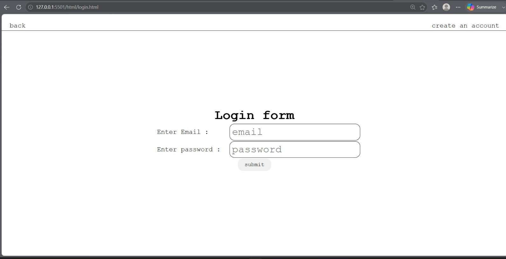
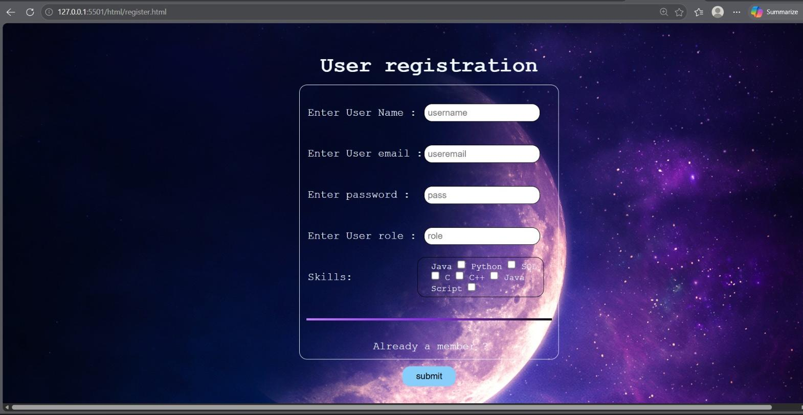
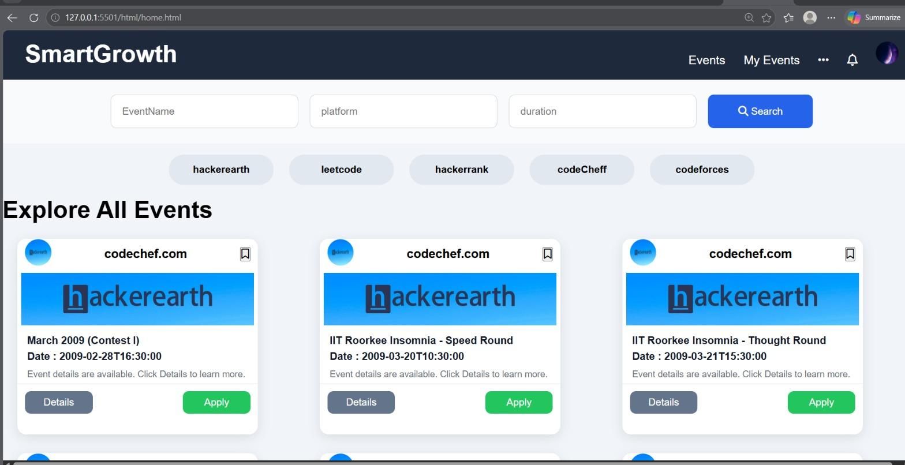
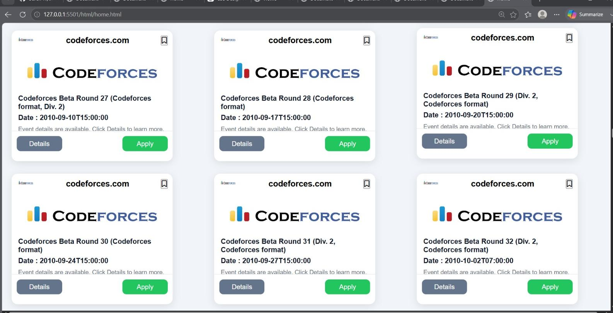
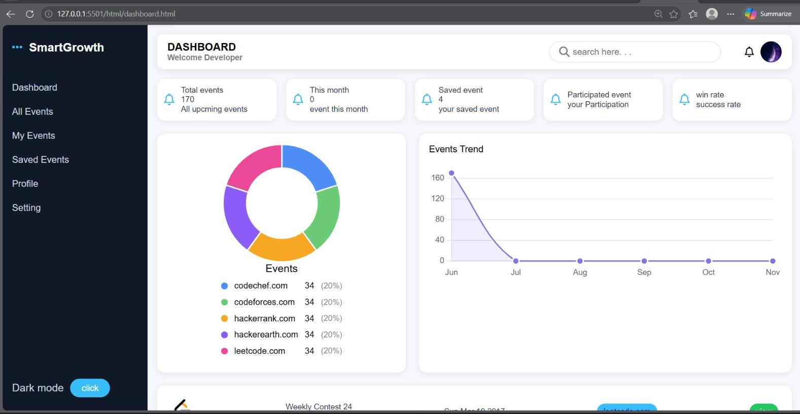
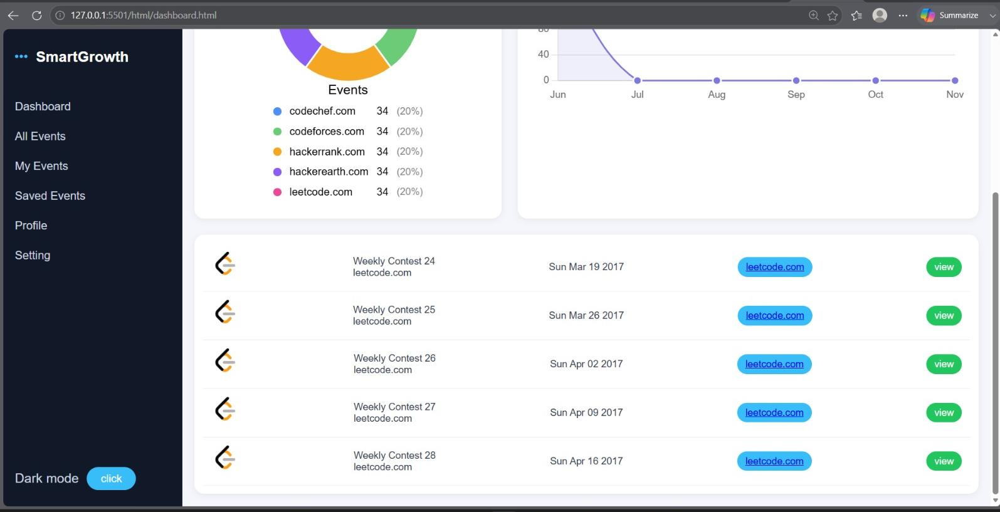

# Smart Growth Event Collector

A full-stack event aggregation platform built using Java, Spring Boot, Hibernate, MySQL, HTML, CSS, and JavaScript that collects events from multiple external platforms and presents them through a single unified dashboard.

---

## Problem Statement

Users interested in coding contests, workshops, hackathons, and technical events often need to visit multiple platforms such as LeetCode, HackerRank, and other event websites to track upcoming opportunities.

This process is repetitive, time-consuming, and inefficient.

Smart Growth Event Collector solves this problem by automatically collecting event data from multiple sources and displaying it in a centralized platform where users can discover, search, filter, and manage events from one place.

---

## Key Features

### Event Aggregation
- Fetches events from external APIs
- Processes and normalizes incoming data
- Stores event information in a centralized database

### Event Discovery
- Search events using keywords
- Filter by category
- Filter by platform
- Filter by location

### User Management
- User Registration
- User Login
- Saved Events Tracking

### Analytics Dashboard
- Event statistics
- Category-wise analytics
- Platform-wise analytics
- Interactive charts and visual insights

---

## Tech Stack

### Backend
- Java
- Spring Boot
- Spring MVC
- Hibernate (JPA)
- Spring WebClient
- REST APIs

### Frontend
- HTML5
- CSS3
- JavaScript

### Database
- MySQL

### Tools
- Git
- GitHub
- Maven
- Postman
- IntelliJ IDEA

---

## Architecture

External Event APIs
        ↓
Spring WebClient
        ↓
Spring Boot Application
        ↓
Hibernate (JPA)
        ↓
MySQL Database
        ↓
REST APIs
        ↓
Frontend Dashboard

---

## Screenshots

### Login Page


### Registration Page


### Home Page


### Event Display


### Dashboard


### Dashboard Analytics



## What I Implemented

- Designed and developed a complete Spring Boot backend application
- Integrated external event APIs using Spring WebClient
- Built RESTful APIs for event management
- Implemented Hibernate JPA for database persistence
- Designed MySQL database schema and entity relationships
- Developed responsive frontend interfaces using HTML, CSS, and JavaScript
- Created analytics dashboards for event insights
- Managed version control using Git and GitHub

---

## Technical Highlights

### API Integration
- Consumed external event APIs
- Transformed API responses before persistence
- Implemented error handling for API failures

### Database Design
- Entity relationship mapping using Hibernate
- Optimized event storage and retrieval
- Structured relational database design

### Backend Development
- Layered architecture
- RESTful API design
- Service-based business logic
- MVC pattern implementation

---

## Future Enhancements

- JWT Authentication
- Role-Based Access Control
- Email Notifications
- Real-Time Event Updates
- Cloud Deployment

---

## Installation

Clone the repository:

```bash
git clone https://github.com/Suren-IT/Smart_Growth_Event_Collector.git
```

Navigate to the project:

```bash
cd Smart_Growth_Event_Collector
```

Configure MySQL credentials in:

```properties
application.properties
```

Run the application:

```bash
mvn spring-boot:run
```

---

## Author

### Suren S
Java Full Stack Developer

GitHub:
https://github.com/Suren-IT

LinkedIn:
[YOUR_LINKEDIN_URL](https://www.linkedin.com/in/suren-s-it)

Email:
ssuren2021@gmail.com

---

## Project Goal

This project was developed to demonstrate practical experience in Java backend development, REST API integration, database management, and full-stack application development using industry-standard technologies.
